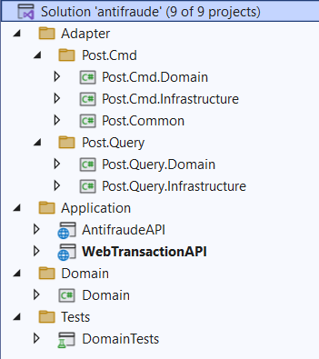

# Arquitectura de la solución 

**NOTA: revisar el video cargado en antifraude.mp4, cargado al github** 

## Tecnologías Utilizadas 
1)	Arquitectura Hexagonal
2)	Microservicios
3)	DDD
4)	CQRS
5)	TDD
6)	Aggregate
7)	Mediator Pattern
8)	Event Sourcing
9)	SOLID
10)	DRY
11)	YAGNI
12)	Kafka
13)	Entity Framework Core
14)	Web API
15)	SQL Server
16)	MongoDB
17)	Docker
18)	Postman
19)	REST
20	NET 8
21)	LINQ
22)	SSMS

## Versión de dotnet instalada 
dotnet --version 

## Versión de Docker instalada 
docker --version

## Versión de Docker Compose instalado
docker-compose --version 

## Crear una red con el siguiente comando  
docker network create --attachable -d bridge mydockernetwork

## Para verificar la red si fue creada 
docker network ls

## Para apache kafka se distribuye el docker compose 
docker-compose.yml

Ejecutar el comando 
**docker-compose up -d**

## Para mongo container  
docker run -it -d --name mongo-container -p 27017:27017 --network mydockernetwork --restart always -v mongodb_data_container:/data/db mongo:latest

## Para SQL Server
docker run -d --name sql-container --network mydockernetwork --restart always -e 'ACCEPT_EULA=Y' -e 'SA_PASSWORD=$tr0ngS@P@ssw0rd02' -e 'MSSQL_PID=Express' -p 1433:1433 mcr.microsoft.com/mssql/server:2017-latest-ubuntu

En Docker Desktop se puede visualizar los dockers creados hasta el momento 

## En SSMS 
1) Ejecutar WebTransactionAPI con el usuario sa para que se creen la tabla y base de datos del journal
2) Ejecutar el script Create-SMUser.sql el cual permite crear el usuario propietario para la base de datos creada

   
3) Cambiar las conexiones de los servicios en las dos microservicios anti-fraude y transacciones

 
## Estructura del proyecto

## Testing 

1) Con postman se ejecuta 

2) Se puede visualizar en la base de datos la trx con estado pendiente 

3) Event Sourcing se muestra en MongoDB el evento almacenado 

 
4) En Kafka en el topic request se puede visualizar el mensaje de la transacción 

5) El micro de antifraude realiza la validación y el resultado se muestra en el otro topic, que en base al monto la transacción es exitosa 

6) para visualizar el estado en la base de datos sql server con SSMS.
   

 
