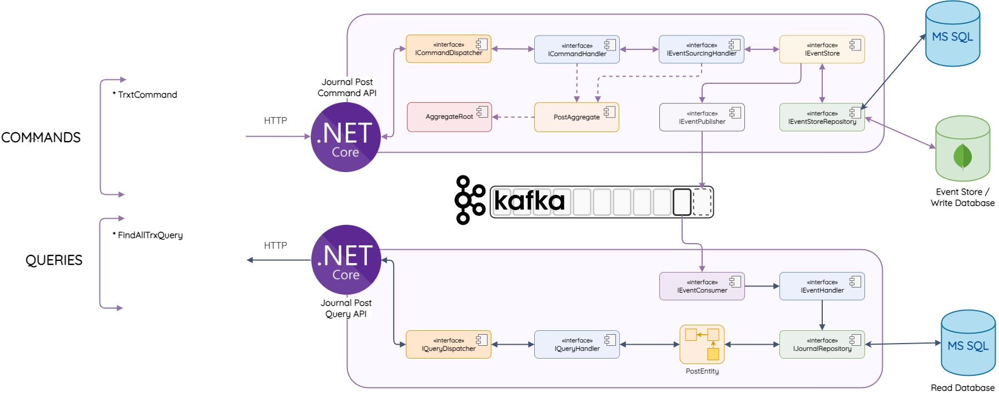

# Arquitectura de la solución 

 
 
## Tecnologías Utilizadas 
1)	Arquitectura Hexagonal
2)	Microservicios
3)	DDD
4)	CQRS
5)	TDD
6)	Aggregate
7)	Mediator Pattern
8)	Event Sourcing
9)	SOLID
10)	DRY
11)	YAGNI
12)	Kafka
13)	Entity Framework Core
14)	Web API
15)	SQL Server
16)	MongoDB
17)	Docker
18)	Postman
19)	REST
20	NET 8
21)	LINQ
22)	SSMS

## Versión de dotnet instalada 
dotnet --version 

## Versión de Docker instalada 
docker --version

## Versión de Docker Compose instalado
docker-compose --version 

## Crear una red con el siguiente comando  
docker network create --attachable -d bridge mydockernetwork

## Para verificar la red si fue creada 
docker network ls

## Para apache kafka se distribuye el docker compose 
docker-compose.yml

Ejecutar el comando 
**docker-compose up -d**

## Para mongo container  
docker run -it -d --name mongo-container -p 27017:27017 --network mydockernetwork --restart always -v mongodb_data_container:/data/db mongo:latest

## Para SQL Server
docker run -d --name sql-container --network mydockernetwork --restart always -e 'ACCEPT_EULA=Y' -e 'SA_PASSWORD=$tr0ngS@P@ssw0rd02' -e 'MSSQL_PID=Express' -p 1433:1433 mcr.microsoft.com/mssql/server:2017-latest-ubuntu

Se Docker Desktop se puede visualizar los dockers creados hasta el momento 

## En SSMS 
1) Ejecutar WebTransactionAPI con el usuario sa para que se creen la tabla y base de datos del journal
2) Ejecutar el script Create-SMUser.sql el cual permite crear el usuario propietario para la base de datos creada
3) Cambiar las conexiones de los servicios en las dos microservicios anti-fraude y transacciones

3) 
Con Entity Framework ejecutar WebTransactionAPI con usuario sa para crear la tabla 
Cambiar el string de conexión archivo Create-SMUser.sql
 
 

Estructura del proyecto
 
Se requiere ejecutar los dos microservicios o como se muestra en el video haciendo debug 
Aprobado 
 
Se puede visualizar en la base de datos almacenado con el estado pendiente 
 
Para el tema de evento sourcing se puede visualizar en mongo la transacción que se ejecuto 
 
En Kafka podemos visualizar que el topic se tiene el mensaje de la transacción 
 
En el otro tópico después de ejecutar se puede visualizar que la transacción fue exitosa 
 
El estado fue actualizado en la base de datos. 
 
